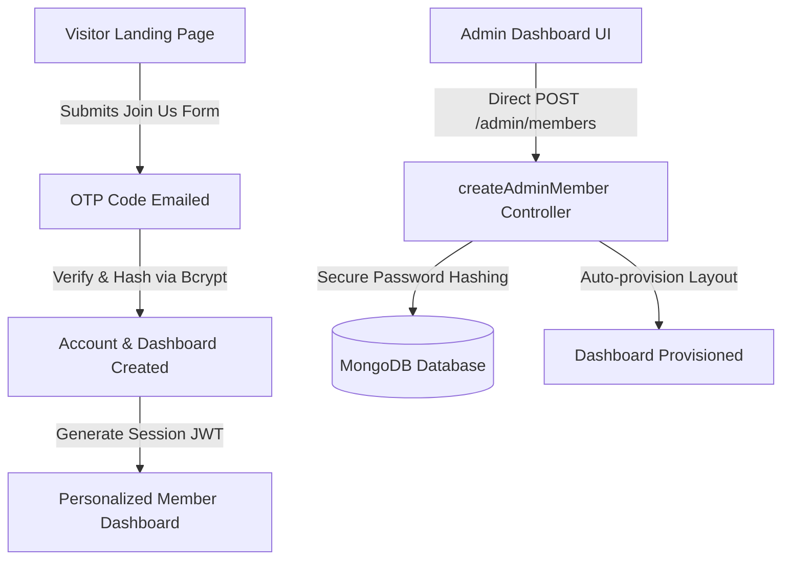

# Founders Connect: Complete Ecosystem Platform 🚀

<div align="center">
  
  
  <p align="center">
    <strong>A high-performance premium networking ecosystem and analytics hub connecting builders, founders, and investors.</strong>
  </p>

  <p align="center">
    
    
    
    
  </p>
</div>

---

## 📖 Table of Contents
1. [Core Features](#-core-features)
2. [Premium UI/UX Design & Aesthetics](#-premium-uiux-design--aesthetics)
3. [Technology Stack](#-technology-stack)
4. [Ecosystem Architecture & Flow](#-ecosystem-architecture--flow)
5. [Getting Started & Installation](#-getting-started--installation)
6. [Environmental Variables Configuration](#-environmental-variables-configuration)
7. [Administrative Dashboard Capabilities](#-administrative-dashboard-capabilities)
8. [License](#-license)

---

## 🌟 Core Features

### 👥 1. Multi-Role Ecosystem Member Dashboards
* **Builders & Users**: Custom dashboard widgets to track commitments, community involvement, and local ecosystem resources.
* **Founders Panel**: Specialized tools including live **Monthly Recurring Revenue (MRR) Trackers**, funding stage progress meters, and pitch deck sharing assets.
* **Investor Matcher**: Customized portfolio management grids, direct-inquiry submission lines, and commitment tables.

### 📅 2. Live Dynamic Content Systems
* **Dynamic Event Scheduler**: Host-controlled event registration modules supporting custom ticketing labels (e.g. Free RSVP / Member Only), FAQs, refund policies, and calendar APIs.
* **Interactive Editorial Blogs**: Custom-authored blogs categorized by tags and built using multi-heading layouts for seamless ecosystem coverage.
* **Sponsors & Supporter Slider**: Live adjustable carousels displaying proud ecosystem sponsors and college/E-cell networks.

### 📩 3. Automated Campaigns & Broadcasts
* **Email Automation Engine**: Send unified broadcast newsletters or localized announcements directly to active subscribers, ecosystem members, or custom lists.
* **Email OTP Verification Gates**: Bulletproof email validation using temporary code tokens before allowing user signups or partner inquiries.

---

## 🎨 Premium UI/UX Design & Aesthetics

Founders Connect is stylized to deliver a premium look:
* **Brand Theme Color**: Violet Purple brand palette:
  * **HSL**: `hsl(264, 84%, 46%)`
  * **RGB**: `rgb(97, 19, 216)`
  * **Hex**: `#6113D8`
* **Masked Radial Glows**: Curve-masked backgrounds, backdrop-blurred card container styling, and radial glow spotlights that align beautifully.
* **Micro-Animations**: Fluid hover-scales, spinning conic glow borders, and sliding marquee animations for speaker profiles and testimonials.
* **Footer Spotlight Effect**: Interactive "FOUNDERS CONNECT" typographic layout with an automated cursor reflection spotlight mapping.

---

## 🛠️ Technology Stack

* **Frontend Framework**: [React 18](https://react.dev/) + [Vite](https://vitejs.dev/) (Vite-fast compilation, HMR enabled)
* **Styling Engine**: [Tailwind CSS](https://tailwindcss.com/) + Custom HSL design tokens
* **Icons**: [Lucide React](https://lucide.dev/)
* **Backend API**: [Node.js](https://nodejs.org/) + [Express.js](https://expressjs.com/) REST APIs
* **Database Layer**: [MongoDB](https://www.mongodb.com/) + [Mongoose ORM](https://mongoosejs.com/)
* **Password Encryption**: [Bcrypt.js](https://www.npmjs.com/package/bcryptjs) (Cost Factor 12 Hashing)
* **Session Authorization**: Stateless JSON Web Tokens ([JWT](https://jwt.io/))
* **Media Asset Storage**: [Cloudinary](https://cloudinary.com/) (Secure signed image and media uploading)

---

## 🏗️ Ecosystem Architecture & Flow



---

## 🚀 Getting Started & Installation

### Prerequisites
* Ensure you have [Node.js](https://nodejs.org/) (v16+) installed.
* Access to a running [MongoDB](https://www.mongodb.com/) instance (local or Atlas URI).
* A [Cloudinary](https://cloudinary.com/) account for managing dynamic image uploads.

---

### Step 1: Clone and Set Up the Backend
1. Navigate into the server directory:
   ```bash
   cd backend
   ```
2. Install node dependencies:
   ```bash
   npm install
   ```
3. Create a `.env` configuration file inside `backend/`:
   ```env
   PORT=4000
   MONGODB_URI=mongodb+srv://your_uri_here
   JWT_SECRET=your_jwt_signing_key_here
   
   # Cloudinary Keys
   CLOUDINARY_CLOUD_NAME=your_cloud_name
   CLOUDINARY_API_KEY=your_api_key
   CLOUDINARY_API_SECRET=your_api_secret
   ```
4. Launch the API server:
   ```bash
   npm run dev
   ```

---

### Step 2: Set Up the Frontend Client
1. Return to the root workspace directory and install dependencies:
   ```bash
   npm install
   ```
2. Create a `.env.local` configuration file in the root workspace directory:
   ```env
   VITE_API_BASE_URL=http://localhost:4000
   ```
3. Start the Vite client dev server:
   ```bash
   npm run dev
   ```
4. Open [http://localhost:5173](http://localhost:5173) in your browser!

---

## ⚙️ Environmental Variables Configuration

### Backend variables (`backend/.env`)
| Variable | Description | Requirement |
| :--- | :--- | :--- |
| `PORT` | Local runtime port of Express backend (defaults to 4000) | Optional |
| `MONGODB_URI` | MongoDB Atlas cluster connection string | **Required** |
| `JWT_SECRET` | Cryptographic secret key used to sign session tokens | **Required** |
| `CLOUDINARY_CLOUD_NAME` | Cloudinary storage bucket cloud name identifier | **Required** |
| `CLOUDINARY_API_KEY` | Cloudinary API access key | **Required** |
| `CLOUDINARY_API_SECRET` | Cloudinary private API secret token | **Required** |

### Frontend variables (`.env.local`)
| Variable | Description | Requirement |
| :--- | :--- | :--- |
| `VITE_API_BASE_URL` | Base endpoint route pointing to the running backend | **Required** |

---

## 🛡️ Administrative Dashboard Capabilities

The **Founders Connect Admin Panel** features complete database management tools:

1. **Sponsors & Partner Slider** (under `Partners` tab):
   * Add, edit, or delete proud sponsors.
   * Specify sponsor website URLs, logo dimensions, and display priority keys.
2. **Dynamic Member Management** (under `Members & Requests` tab):
   * **Add Members Manually**: Input name, email, credentials, and select ecosystem role (Builder User, Founder, Investor).
   * **Bcrypt Protection**: Auto-hashes credentials for secure database entry.
   * **Dashboard Auto-creation**: Instantly allocates widget layouts so the member's profile is immediately active.
   * **Interactive Query Search**: Filter member registries by name, email, location, or ecosystem status.
   * **Safe Deletion Actions**: Delete members with database cascade purging (safeguarded against deleting administrators).

---

## 📄 License

This ecosystem platform is developed for founders and builders matching. All rights reserved.
