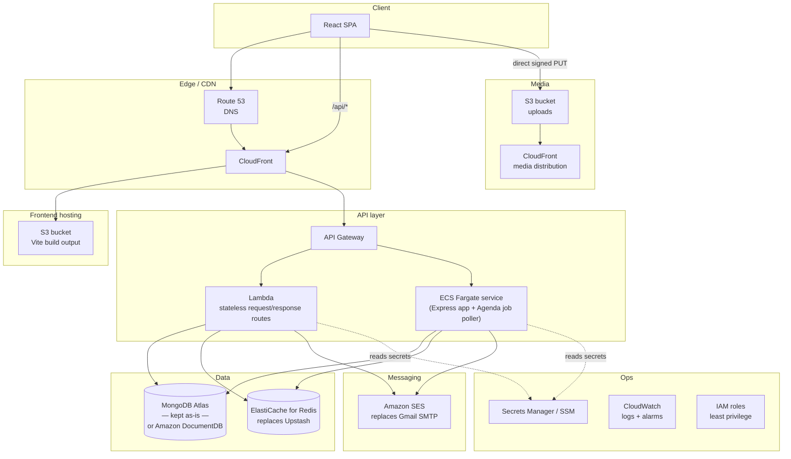

# Founders Connect — AWS Migration Guide (Proposal)

> **Status: this is a proposal, not the current setup.** As of this writing, Founders Connect runs
> entirely on non-AWS managed services: **Vercel** (hosting + serverless API), **MongoDB Atlas**
> (database), **Cloudinary** (media), **Gmail SMTP via Nodemailer** (email), **Groq** (AI chat),
> and **Upstash** (Redis cache). Nothing in this repository currently uses AWS. This document maps
> each current piece to an AWS equivalent, explains why you might make that swap, and lays out a
> phased plan — for if/when the team decides to move onto AWS.

---

## 1. Current stack at a glance

| Concern | Current service | Notes |
| --- | --- | --- |
| Frontend hosting | Vercel (static build + CDN) | See [readme/DEVELOPER_GUIDE.md](../readme/DEVELOPER_GUIDE.md) §13 |
| API hosting | Vercel serverless function (`api/index.js` wraps Express) | Cold-start Mongo connection caching |
| Database | MongoDB Atlas | Mongoose ODM, discriminator-based schemas |
| Media storage | Cloudinary | Client-direct signed uploads (backend never touches file bytes) |
| Outbound email | Gmail SMTP via Nodemailer | OTPs, password resets, newsletters, campaigns |
| AI chat | Groq API (Llama 3.1) | Simple proxy endpoint, no AWS involvement |
| Cache | Upstash Redis (REST API) | Hot read paths for public content |
| Background jobs | Agenda (MongoDB-backed) | Needs a long-running Node process — doesn't fit pure serverless |
| Secrets | Plain `.env` files | ⚠️ Currently some real secrets are committed to git (`backend/.env.example`) — see the Developer Guide's security note. This must be fixed regardless of whether you move to AWS. |

This setup is **low-effort and cheap at small scale** — every piece is a managed service with a
generous free tier, and there's no infrastructure to operate. The trade-offs below are why a team
might still choose AWS.

## 2. Why consider AWS at all

Reasonable, common drivers (weigh these against your actual situation before committing):

- **Single-vendor consolidation** — one bill, one IAM model, one support relationship, easier to
  reason about compliance/audit boundaries (SOC2, data residency) if the org is already on AWS.
- **Networking control** — put the database, cache, and API inside a VPC with security groups,
  instead of trusting each SaaS vendor's own perimeter.
- **Long-running processes** — Agenda's job poller wants a persistent Node process; Vercel's
  serverless model fights that today. AWS gives you ECS/Fargate or EC2 for that without leaving
  the AWS ecosystem.
- **Fine-grained cost control at scale** — Vercel/Atlas/Cloudinary pricing can get expensive as
  traffic/storage grow; AWS lets you tune instance sizes, storage classes, and caching more
  precisely (at the cost of more ops work).
- **Secrets governance** — moving off committed `.env` files onto AWS Secrets Manager / SSM
  Parameter Store with IAM-scoped access is a meaningfully better security posture than the
  current file-based approach.

**Trade-off to weigh honestly:** you're replacing "no ops" managed services with services that need
more configuration (VPCs, IAM policies, autoscaling, patching for anything EC2-based). For a small
team, that's a real cost. This guide assumes the migration is worth it for your context — the
mapping below stays useful even for a partial migration (e.g. just moving secrets and email).

---

## 3. Proposed AWS architecture



**Key architectural decision:** split the current single Express app into two deployment targets
instead of one:
- **API Gateway + Lambda** for the stateless, request/response routes (content, profile, auth,
  most of admin) — this is the direct equivalent of today's Vercel serverless function.
- **ECS Fargate** for anything that needs a persistent process — specifically the **Agenda job
  poller** (scheduled campaign sends) which cannot live in a Lambda that gets frozen between
  invocations. You can run the *same* `backend/app.js` Express app inside the Fargate container
  (so campaign-sending code doesn't need to be rewritten) while Lambda handles everything else, or
  simplify by putting the entire API on Fargate behind an Application Load Balancer if you'd
  rather not split it at all — that's the lower-complexity option and worth doing first.

---

## 4. Service-by-service mapping

| Current | AWS equivalent | Why | Migration effort |
| --- | --- | --- | --- |
| Vercel static hosting (frontend) | **S3 + CloudFront** (or AWS Amplify Hosting for less config) | S3 for the `dist/` build output, CloudFront as CDN + TLS + custom domain. Amplify Hosting is the closer 1:1 replacement for "push to git, get a URL" simplicity if you want less manual setup. | Low — it's a static build either way |
| Vercel serverless function (`api/index.js`) | **API Gateway + Lambda** (stateless routes) or **ECS Fargate + ALB** (whole app, simplest) | Lambda mirrors today's serverless model most closely; Fargate is simpler if you don't want to split routes and need Agenda running anyway | Medium — Fargate is a near-lift-and-shift of `backend/app.js`; Lambda needs each route wrapped per-function or behind a Lambda web adapter |
| MongoDB Atlas | **Keep Atlas** (it's cloud-agnostic and works fine from AWS) or **Amazon DocumentDB** (MongoDB-API compatible) | Atlas: zero migration, cross-cloud is normal and fine. DocumentDB: fully inside your AWS VPC/IAM boundary, but it's *API-compatible*, not identical — check your Mongoose version and any aggregation features against DocumentDB's compatibility notes before committing. | Atlas: none. DocumentDB: Medium-High (data migration + compatibility testing) |
| Cloudinary | **S3 + CloudFront**, uploads via **S3 presigned URLs** (direct replacement for Cloudinary's signed-upload flow already used in `backend/utils/cloudinary.js`) | Keeps the "client uploads directly, server never touches bytes" pattern already in place — swap `createCloudinaryUploadSignature` for an S3 `PutObjectCommand` presigned URL generator. Image transforms (resize/crop) move to Lambda@Edge or CloudFront Functions, or a library like `sharp` in a small Lambda, since Cloudinary did that for free today. | Medium — the signed-upload contract changes shape, frontend upload code needs updating |
| Gmail SMTP / Nodemailer | **Amazon SES** | Purpose-built transactional email service, better deliverability at scale, native domain verification (SPF/DKIM/DMARC) versus a personal Gmail app password (which is also flagged as a real leaked credential in the current repo). `sendEmail()` in `backend/utils/email.js` just needs a new transport — Nodemailer has a built-in SES transport, or use the AWS SDK's `SESv2Client` directly. | Low-Medium |
| Groq API | Stays external — **or** swap for **Amazon Bedrock** if you want the AI provider inside AWS too | Groq isn't AWS and doesn't need to be; Bedrock is the AWS-native alternative if full-stack consolidation matters more than Groq's speed/pricing | Optional, Medium if you switch models |
| Upstash Redis | **Amazon ElastiCache for Redis** (or MemoryDB for Redis) | Same Redis protocol; `backend/utils/cache.js` currently talks to Upstash's REST API specifically, so switching to ElastiCache means switching to a standard `redis`/`ioredis` client instead (ElastiCache doesn't offer a public REST endpoint by default — it's VPC-internal) | Low-Medium |
| Agenda (Mongo-backed jobs) | Keep Agenda running inside the **Fargate** service, or replatform onto **EventBridge Scheduler + Lambda** for simpler recurring jobs | Agenda needs a live poller process — Fargate is the direct fit. EventBridge Scheduler is a better fit if the job set is small and well-defined (e.g. "send this campaign at this timestamp") rather than a general job queue | Medium |
| `.env` files (**currently has real secrets committed to git — fix this immediately, AWS or not**) | **AWS Secrets Manager** (rotatable secrets) or **SSM Parameter Store** (cheaper, fine for static config) | IAM-scoped access, automatic rotation support (Secrets Manager), audit trail via CloudTrail, no more plaintext secrets in the repo | Low-Medium |
| Vercel's domain/DNS | **Route 53** | Standard AWS DNS, integrates with ACM for free TLS certs on CloudFront/ALB | Low |
| (none today — no CI/CD in-repo) | **CodePipeline + CodeBuild**, or keep **GitHub Actions** deploying to AWS via OIDC role assumption | Either works; GitHub Actions + OIDC is usually less AWS-specific glue if the team is already comfortable with GitHub Actions | Low-Medium |
| (implicit — Vercel/Atlas/Cloudinary logs) | **CloudWatch Logs + Alarms**, **CloudTrail** | Centralized logging/metrics/alerting once everything is in AWS | Low |
| N/A today | **IAM roles + VPC + security groups** | Least-privilege access between Fargate/Lambda ↔ ElastiCache/DocumentDB, private subnets for data stores | Medium (design work, not code) |

---

## 5. Phased migration plan

Don't do this all at once. Suggested order, each phase independently valuable and shippable:

### Phase 0 — Fix the security issue (do this regardless of AWS)
Rotate every credential currently committed in `backend/.env.example` (MongoDB password, JWT
secret, Cloudinary keys, Gmail app password, Groq key, Upstash token) and remove the file's secret
values from git history. This is unrelated to AWS but should happen before or alongside any
migration work.

### Phase 1 — Secrets & email (lowest risk, immediate win)
1. Create secrets in **AWS Secrets Manager** for each credential in §1's table.
2. Add an SES sending domain, verify it (DKIM/SPF records in Route 53 or your current DNS), request
   production access (SES starts in a sandbox that only sends to verified addresses).
3. Update `backend/utils/email.js` to use an SES transport instead of Gmail SMTP.
4. Keep everything else (Vercel, Atlas, Cloudinary) unchanged during this phase.

### Phase 2 — Media storage
1. Create an S3 bucket + CloudFront distribution for uploads.
2. Replace `backend/utils/cloudinary.js`'s signature generator with an S3 presigned-URL generator
   (`@aws-sdk/s3-request-presigner`).
3. Update the frontend upload code (wherever `getCloudinaryUploadSignatureApi` /
   `getPublicCloudinaryUploadSignatureApi` are consumed in `src/lib/api.ts` and its callers) to
   `PUT` to the presigned S3 URL instead of Cloudinary's upload endpoint.
4. Backfill or leave existing Cloudinary-hosted URLs as-is (they'll keep working; only new uploads
   go to S3) unless you also migrate historical assets.

### Phase 3 — Compute (API + jobs)
1. Containerize `backend/` (a simple `Dockerfile` running `node server.js`).
2. Stand up an ECS Fargate service behind an Application Load Balancer, in a VPC with private
   subnets for the service and public subnets for the ALB.
3. Point Agenda / the whole Express app at this service — this is where the always-on job poller
   finally has a proper home.
4. Optionally split out high-traffic stateless routes to Lambda + API Gateway later, once the
   simple Fargate lift-and-shift is stable.

### Phase 4 — Frontend hosting + DNS cutover
1. Build the Vite app, upload `dist/` to an S3 bucket, front it with CloudFront.
2. Point Route 53 at CloudFront (frontend) and the ALB/API Gateway (API), matching today's
   `vercel.json` rewrite behavior (`/api/*` → backend, everything else → SPA / `index.html` for
   client-side routing — CloudFront needs a custom error response mapping 403/404 → `index.html`
   to replicate this).
3. Cut DNS over once both sides are verified end-to-end in a staging environment.

### Phase 5 — Database (optional, evaluate carefully)
Only do this if there's a concrete driver (compliance, cost at scale, wanting everything in one
VPC). Migrating MongoDB Atlas → Amazon DocumentDB requires:
1. Compatibility testing — DocumentDB implements a subset of the MongoDB API; run the full test
   suite (`npm test`) and manually exercise every discriminator-based query pattern in
   `backend/models/account.model.js` against DocumentDB before committing.
2. Data migration via AWS Database Migration Service (DMS) or `mongodump`/`mongorestore` through a
   bastion host (DocumentDB is VPC-only, no public endpoint).
3. Cutover with a maintenance window; keep Atlas as a rollback target until confidence is high.

If there's no strong driver, **leave the database on Atlas** — it works fine alongside an
otherwise-AWS stack, and skipping this phase removes the highest-risk, highest-effort part of the
whole migration.

---

## 6. Illustrative snippets

These aren't meant to be copy-pasted turnkey — they show the shape of the work for a couple of the
higher-value phases.

**S3 bucket + CloudFront for the frontend build (AWS CLI):**
```bash
aws s3 mb s3://founders-connect-frontend
aws s3 sync dist/ s3://founders-connect-frontend --delete
aws cloudfront create-distribution \
  --origin-domain-name founders-connect-frontend.s3.amazonaws.com \
  --default-root-object index.html
```

**Storing a secret (replaces a line in `backend/.env`):**
```bash
aws secretsmanager create-secret \
  --name founders-connect/jwt-secret \
  --secret-string "$(openssl rand -base64 48)"
```

**S3 presigned upload URL (replaces `createCloudinaryUploadSignature` in `backend/utils/cloudinary.js`):**
```js
import { S3Client, PutObjectCommand } from "@aws-sdk/client-s3";
import { getSignedUrl } from "@aws-sdk/s3-request-presigner";

const s3 = new S3Client({ region: "ap-south-1" });

export const createS3UploadUrl = async ({ key, contentType }) => {
  const command = new PutObjectCommand({ Bucket: "founders-connect-media", Key: key, ContentType: contentType });
  const uploadUrl = await getSignedUrl(s3, command, { expiresIn: 60 });
  return { uploadUrl, key };
};
```

**SES send (replaces the Nodemailer/Gmail transport in `backend/utils/email.js`):**
```js
import { SESv2Client, SendEmailCommand } from "@aws-sdk/client-sesv2";

const ses = new SESv2Client({ region: "ap-south-1" });

export const sendEmail = async ({ to, subject, html }) => {
  await ses.send(new SendEmailCommand({
    FromEmailAddress: "no-reply@foundersconnect.co.in",
    Destination: { ToAddresses: [to] },
    Content: { Simple: { Subject: { Data: subject }, Body: { Html: { Data: html } } } },
  }));
};
```

---

## 7. Rollback strategy

For every phase, keep the old service reachable and untouched until the new one is verified:
- Phase 1: leave Gmail SMTP env vars in place; only switch the code path once SES sends are
  confirmed delivered in production-like testing.
- Phase 2: keep Cloudinary credentials valid; only cut new uploads over, don't delete the
  Cloudinary account until you're sure nothing references it anymore.
- Phase 3: run Fargate in parallel with the existing Vercel function, route a small percentage of
  traffic (or just internal/staging traffic) to it first via DNS weighting or a feature flag.
- Phase 4: use Route 53 weighted routing to shift traffic gradually rather than an instant cutover.
- Phase 5: keep the Atlas cluster running and in sync (or simply paused, not deleted) for at least
  one full billing/monitoring cycle after cutover.

---

## 8. Qualitative cost/complexity comparison

| | Current (Vercel + Atlas + Cloudinary) | Proposed (AWS) |
| --- | --- | --- |
| Ops burden | Very low — fully managed, no servers to patch | Higher — VPC, IAM, container/Lambda deploys are your responsibility |
| Vendor count | 5 (Vercel, Atlas, Cloudinary, Gmail, Groq/Upstash) | 1 (AWS) for everything except Groq if you keep it |
| Cost predictability | Simple until traffic/storage scale up, then can get pricey per-vendor | More levers to tune (reserved capacity, storage classes) but requires active management |
| Background jobs (Agenda) | Awkward fit on serverless | Native fit on Fargate |
| Security/compliance control | Depends on each vendor's own controls | Full control via IAM/VPC/CloudTrail, but you own getting it right |
| Time to first deploy | Minutes (already working today) | Days-to-weeks depending on phase scope |

**Bottom line:** the current stack is a good fit for a small/early-stage team optimizing for speed.
AWS becomes worth the added complexity once you have a concrete driver — compliance requirements,
a need to run Agenda properly, or cost/control needs that the current managed services can't meet.
