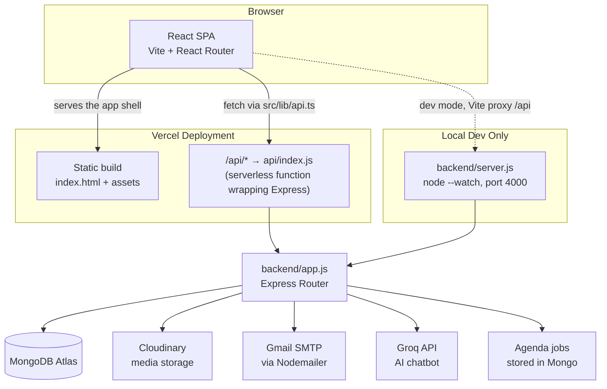

# Founders Connect — Full-Stack Developer Guide

> **Who this is for:** junior/new full-stack, frontend, or backend engineers joining this repo.
> By the end of this document you should be able to run the project locally, understand how a
> request travels from a button click in the browser to MongoDB and back, and know where to add
> code for a new feature.

---

## 1. What this project is

Founders Connect is a networking platform for **builders, founders, and investors**. Members
register under a role (`user`, `founder`, `investor`), get a personalized dashboard, and can share
a public profile card. There's a separate **admin panel** (`admin` / `superadmin` roles) for
managing site content (blogs, events, gallery, testimonials, sponsors), newsletters/email
campaigns, join requests, funding applications, and investor invites.

It is a classic **MERN-style** app, but deployed as a single Vercel project that serves both the
React SPA and the Express API as a serverless function.

---

## 2. Tech stack

| Layer | Technology | Where |
| --- | --- | --- |
| Frontend framework | React 18 + Vite 7 + TypeScript | [src/](../src) |
| Routing | React Router v6 | [src/App.tsx](../src/App.tsx) |
| Server state / caching | TanStack Query (`@tanstack/react-query`) | [src/App.tsx](../src/App.tsx) |
| UI components | shadcn/ui (Radix primitives) + Tailwind CSS | [src/components/ui/](../src/components/ui) |
| Forms | react-hook-form + zod | various `src/pages/Register*.tsx` |
| Backend framework | Node.js + Express 4 | [backend/app.js](../backend/app.js) |
| Database | MongoDB + Mongoose ODM | [backend/config/mongodb.js](../backend/config/mongodb.js) |
| Auth | JWT (jsonwebtoken) + bcryptjs (cost factor 12) | [backend/utils/jwt.js](../backend/utils/jwt.js) |
| Media storage | Cloudinary (signed direct uploads) | [backend/utils/cloudinary.js](../backend/utils/cloudinary.js) |
| Email | Nodemailer over SMTP (Gmail) | [backend/utils/email.js](../backend/utils/email.js) |
| Scheduled/background jobs | Agenda (MongoDB-backed job queue) | [backend/config/agenda.js](../backend/config/agenda.js) |
| AI chat | Groq API (Llama 3.1) | [backend/controllers/groq.controller.js](../backend/controllers/groq.controller.js) |
| Hosting | Vercel (SPA + serverless function) | [vercel.json](../vercel.json), [api/index.js](../api/index.js) |
| Tests | Vitest + Testing Library | [src/test/](../src/test), [vitest.config.ts](../vitest.config.ts) |

---

## 3. Repository layout

```
fc/
├── src/                      # React frontend (Vite root)
│   ├── pages/                 # One file per route (Login.tsx, Dashboard.tsx, AdminDashboard.tsx, ...)
│   ├── components/            # Reusable UI (Navbar, Footer, forms, admin widgets, AI chatbot...)
│   │   └── ui/                # shadcn/ui primitives (button, dialog, table, sidebar, ...)
│   ├── lib/
│   │   ├── api.ts             # EVERY backend call lives here (fetch wrapper + typed functions)
│   │   ├── session.ts         # localStorage-backed auth session (token + account)
│   │   ├── formValidation.ts, cloudinary.ts, events.ts, blogs.ts, googleMaps.ts, utils.ts
│   ├── hooks/                 # use-toast, use-mobile, useSEO, useCountingEffect
│   ├── App.tsx                # Route table (this is your map of the whole site)
│   └── main.tsx                # React root / entry point
│
├── backend/                   # Express API (standalone Node app)
│   ├── app.js                  # Express app: CORS, JSON body parsing, mounts every router
│   ├── server.js               # Local dev entry point: connects Mongo, then app.listen()
│   ├── routes/                 # Thin route definitions -> controllers
│   ├── controllers/            # Business logic (one file per domain)
│   ├── models/                 # Mongoose schemas (one file per collection) + models/index.js barrel
│   ├── middlewares/             # auth.middleware, admin.middleware, audit.middleware, error.middleware
│   ├── utils/                   # jwt, email, cloudinary, cache, dashboard-template, role-details
│   ├── config/                  # mongodb.js (connection), agenda.js (job scheduler)
│   └── scripts/                 # One-off/seed scripts (seed-admin-user.js, seed-blogs.js, ...)
│
├── api/index.js                # Vercel serverless entry point — wraps backend/app.js for prod
├── vercel.json                 # Rewrites: /api/* -> api/index.js, everything else -> index.html (SPA)
├── package.json                 # Frontend scripts + dependencies (root workspace)
└── backend/package.json         # Backend scripts + dependencies (separate npm workspace)
```

**Rule of thumb for navigating:** if you're chasing "what happens when a user clicks X",
start in `src/pages/`, follow the import into `src/lib/api.ts` to find the endpoint, then
jump to `backend/routes/` → `backend/controllers/` → `backend/models/`.

---

## 4. Architecture overview



Two deployment shapes exist side by side:

- **Local development:** `backend/server.js` runs a normal long-lived Express server on
  `http://localhost:4000`. Vite's dev server proxies `/api/*` requests to it
  (see `server.proxy` in [vite.config.ts](../vite.config.ts)).
- **Production (Vercel):** there is no long-lived server. `api/index.js` is a serverless
  function that lazily connects to MongoDB on cold start (`mongoReady` flag caches the
  connection across warm invocations) and then delegates the request straight into the same
  `backend/app.js` Express app. `vercel.json` rewrites `/api/*` to that function and everything
  else to `index.html` so React Router can handle client-side routing.

---

## 5. Getting started locally

### Prerequisites
- Node.js v18+ and npm (or `bun`, since `bun.lock`/`bun.lockb` are present)
- A MongoDB connection string (Atlas cluster or local `mongod`)
- A Cloudinary account (cloud name + API key/secret) if you'll touch uploads
- Optional: SMTP credentials (Gmail app password) if you'll test emails; Groq API key for the AI
  chatbot

### Step 1 — Backend

```bash
cd backend
npm install
```

Create `backend/.env` (this file is git-ignored — never commit real secrets here):

```env
PORT=4000
MONGODB_URI=mongodb+srv://<user>:<password>@<cluster>/<db>
JWT_SECRET=<a-long-random-string>

CLOUDINARY_CLOUD_NAME=<your-cloud-name>
CLOUDINARY_API_KEY=<your-api-key>
CLOUDINARY_API_SECRET=<your-api-secret>

# Optional — only needed to actually send email
SMTP_HOST=smtp.gmail.com
SMTP_PORT=587
SMTP_SECURE=false
SMTP_USER=<your-gmail-address>
SMTP_PASS=<gmail-app-password>

# Optional — AI chatbot
GROQ_API_URL=https://api.groq.com/openai/v1/chat/completions
GROQ_API_KEY=<your-groq-key>
GROQ_MODEL=llama-3.1-8b-instant
```

Run it:

```bash
npm run dev          # node --watch server.js — auto-restarts on file changes
# or
npm run start        # node server.js — no watcher, closer to prod
```

You should see:
```
MongoDB connected successfully.
API server running on http://localhost:4000
```

Sanity check: `GET http://localhost:4000/api/health` → `{ "status": "ok", "mongo": { "connected": true } }`

### Step 2 — Frontend

From the **repo root** (not `backend/`):

```bash
npm install
```

Create `.env.local` in the repo root:

```env
VITE_API_BASE_URL=http://localhost:4000
```

Run it:

```bash
npm run dev           # Vite dev server on http://localhost:8080
```

Open [http://localhost:8080](http://localhost:8080). The Vite proxy config already forwards
`/api/*` to `http://localhost:4000`, so `VITE_API_BASE_URL` mostly matters for
`src/lib/api.ts` when it builds absolute URLs — keep it pointed at your backend.

### Step 3 — Seed an admin account (optional but recommended)

```bash
cd backend
npm run seed-admin
```

This upserts an `admin` role account directly into MongoDB via
[backend/scripts/seed-admin-user.js](../backend/scripts/seed-admin-user.js) — read that file to
see the credentials it creates, then log in at `/admin/login` in the frontend.

### Other useful commands

| Command | Where | What it does |
| --- | --- | --- |
| `npm run build` | root | Production Vite build → `dist/` |
| `npm run build:dev` | root | Build in development mode (unminified, for debugging) |
| `npm run preview` | root | Serve the built `dist/` locally |
| `npm run lint` | root | ESLint over the whole frontend |
| `npm test` | root | Run Vitest test suite once |
| `npm run test:watch` | root | Vitest in watch mode |
| `npm run dev:server` | root | Same as `backend`'s `npm run dev`, runnable from repo root |
| `npm run seed-blogs` | backend | Seed sample blog content |

---

## 6. Environment variables reference

| Variable | Used by | Purpose |
| --- | --- | --- |
| `PORT` | backend | Express listen port (local dev only; Vercel ignores it) |
| `MONGODB_URI` | backend | MongoDB Atlas/local connection string |
| `JWT_SECRET` | backend | Signs/verifies session JWTs — **must** be set in every real environment |
| `CLIENT_ORIGIN` | backend | Comma-separated list consulted for CORS beyond the hardcoded allowlist |
| `CLOUDINARY_CLOUD_NAME` / `_API_KEY` / `_API_SECRET` | backend | Signs direct-upload requests for media |
| `SMTP_HOST` / `SMTP_PORT` / `SMTP_SECURE` / `SMTP_USER` / `SMTP_PASS` (or `EMAIL_USER`/`EMAIL_PASS`) | backend | Outbound email (OTP codes, password reset, newsletters) |
| `NEWSLETTER_FROM_EMAIL` | backend | Overrides the "From" address on bulk sends |
| `GROQ_API_URL` / `GROQ_API_KEY` / `GROQ_MODEL` | backend | Powers the AI chatbot widget |
| `UPSTASH_REDIS_REST_URL` / `UPSTASH_REDIS_REST_TOKEN` | backend | Redis-backed caching (see [backend/utils/cache.js](../backend/utils/cache.js)) |
| `HOST_URL` / `HOST_DOMAIN` | backend | Builds absolute URLs for email assets/links |
| `VITE_API_BASE_URL` | frontend | Base URL the SPA calls for all API requests |

> ⚠️ **Security note:** `backend/.env.example` in this repo currently contains **real, working
> secrets** (a live MongoDB URI with credentials, JWT secret, Cloudinary keys, a Gmail app
> password, a Groq key, an Upstash token), and it is committed to git history. Treat every one of
> those as compromised — rotate them and scrub the file from git history — and never fill
> `.env.example` files with real values going forward. Only ever put placeholders in example env
> files, as done above.

---

## 7. Authentication & authorization model

### Roles
Every account has exactly one `role`: `user`, `founder`, `investor`, `admin`, or `superadmin`.
Mongoose **discriminators** model this — one `accounts` collection, one base schema
(`BaseAccountSchema`), and role-specific sub-schemas layered on top for `roleDetails`:

```js
// backend/models/account.model.js
export const UserAccount = Account.discriminator("user", UserSchema);
export const InvestorAccount = Account.discriminator("investor", InvestorSchema);
export const FounderAccount = Account.discriminator("founder", FounderSchema);
export const AdminAccount = Account.discriminator("admin", new Schema({}));
export const SuperAdminAccount = Account.discriminator("superadmin", new Schema({}));
```

So a founder's `roleDetails` looks like `{ startupName, startupStage, teamSize, startupWebsite }`
while an investor's looks like `{ investmentRange, focusSector, portfolioSize, investorId }` — see
[backend/utils/role-details.js](../backend/utils/role-details.js) for the validation that enforces
this shape at registration time.

### Passwords
Hashed with `bcryptjs` at **cost factor 12** before ever touching the database:
```js
const passwordHash = await bcrypt.hash(String(password), 12);
```

### Tokens
On successful login/register, the backend signs a JWT good for **30 days**:
```js
// backend/utils/jwt.js
export const signAuthToken = (account) => {
  const payload = { id: String(account._id), sub: String(account._id), role: account.role, email: account.email };
  return jwt.sign(payload, process.env.JWT_SECRET || DEFAULT_SECRET, { expiresIn: "30d" });
};
```
The frontend stores that token (plus a copy of the account object) in `localStorage` via
[src/lib/session.ts](../src/lib/session.ts) — there is **no** httpOnly cookie or refresh-token
flow here, it's a plain bearer token pattern.

### Guarding routes

**Backend** — `requireAuth` decodes the `Authorization: Bearer <token>` header and attaches
`req.user = { id, sub, role, email }`; `requireAdmin`/`requireSuperAdmin` then check `req.user.role`:
```js
// backend/middlewares/auth.middleware.js
export const requireAuth = (req, res, next) => {
  const token = (req.headers.authorization || "").replace(/^Bearer\s+/, "");
  if (!token) return res.status(401).json({ message: "Authorization token missing." });
  req.user = verifyAuthToken(token);
  next();
};
```
Every `/api/admin/*` route runs `adminRouter.use(requireAuth, requireAdmin)` up front
([backend/routes/admin.routes.js](../backend/routes/admin.routes.js)), plus `auditLogger` so admin
actions are recorded to the `AuditLog` collection. A handful of routes under `/super/*` additionally
require `requireSuperAdmin`.

**Frontend** — `<ProtectedRoute>` checks `getToken()`/`getAccount()` from `session.ts` before
rendering a page, redirecting to `/login?redirect=<original-path>` if there's no token, or to a
fallback route if the account's role isn't in `allowedRoles`:
```tsx
// src/App.tsx
<Route path="/dashboard" element={
  <ProtectedRoute allowedRoles={["user", "investor", "founder"]} redirectTo="/">
    <Dashboard />
  </ProtectedRoute>
} />
```

---

## 8. Full API reference

Base path in production: `https://<your-domain>/api`. Locally: `http://localhost:4000/api`.
All request/response bodies are JSON. Endpoints marked 🔒 require `Authorization: Bearer <token>`;
🔒🛡️ requires an `admin`/`superadmin` role; 🔒🛡️🛡️ requires `superadmin` specifically.

### Auth — `/api/auth` ([routes/auth.routes.js](../backend/routes/auth.routes.js))

| Method | Path | Controller | Purpose |
| --- | --- | --- | --- |
| POST | `/register` | `auth.controller.register` | Create a `user`/`investor`/`founder` account (requires a prior email-verification token; investors also require a valid invite token) |
| POST | `/login` | `auth.controller.login` | Email+password login → JWT |
| POST | `/admin-login` | `auth.controller.adminLogin` | Same as login but rejects non-admin roles |
| POST | `/email-verification/send` | `email-verification.controller.sendEmailVerificationCode` | Emails a 6-digit OTP for a given purpose (`register:user`, `join-us`, ...) |
| POST | `/email-verification/verify` | `email-verification.controller.verifyEmailCode` | Verifies the OTP, returns a short-lived `verificationToken` consumed by the next call |
| GET | `/investor-invite/:token` | `investor-invite.controller.validateInvestorInvite` | Checks an invite link is active/unexpired |
| POST | `/investor-lead` | `investor-invite.controller.submitInvestorLead` | Captures an investor's interest via an invite link |
| POST | `/forgot-password` | `auth.controller.forgotPassword` | Emails a password-reset OTP (doesn't leak account existence) |
| POST | `/verify-forgot-password-otp` | `auth.controller.verifyForgotPasswordOtp` | Checks the reset OTP |
| POST | `/reset-password` | `auth.controller.resetPassword` | Sets a new password given a valid OTP |

### Content (public, read-mostly) — `/api/content` ([routes/content.routes.js](../backend/routes/content.routes.js))

| Method | Path | Purpose |
| --- | --- | --- |
| GET | `/events` | List published events |
| GET | `/events/slider` | Events flagged for the homepage slider |
| GET | `/events/:slug` | Single event by slug |
| GET | `/blogs` | List published blog posts |
| GET | `/blogs/:slug` | Single blog post |
| GET | `/site-notice` | Active popup/banner notice |
| GET | `/gallery` | Gallery images |
| GET | `/partners` | Sponsor/partner logos |
| GET | `/speakers-investors` | Past speaker/investor profiles |
| GET | `/testimonials` | Testimonials |
| GET | `/partner-types` | Partner category list (used in partner-inquiry forms) |
| GET | `/slider-promotions` | Homepage promo slider items |
| POST | `/cloudinary/sign-upload` | Public-side signed upload (e.g. pitch decks during registration) |
| POST | `/newsletter/subscribe` | Newsletter opt-in (needs `emailVerificationToken`) |
| GET | `/newsletter/unsubscribe?email=` | One-click unsubscribe link target |
| POST | `/join-us` | "Join Us" form submission |
| POST | `/partner-inquiry` | Partner/sponsor inquiry form |
| POST | `/get-funding` | Funding application form |

### Dashboard — `/api/dashboard` ([routes/dashboard.routes.js](../backend/routes/dashboard.routes.js)) — all 🔒

| Method | Path | Purpose |
| --- | --- | --- |
| GET | `/me` | Fetch (and lazily create) the current account's role-specific dashboard with live-computed KPIs |
| PATCH | `/me` | Partially update dashboard fields (title, kpis, tables, layout, ...) |

### Profile — `/api/profile` ([routes/profile.routes.js](../backend/routes/profile.routes.js))

| Method | Path | Auth | Purpose |
| --- | --- | --- | --- |
| GET | `/public/:profileId` | none | Public digital business-card view |
| GET | `/me` | 🔒 | Current account's full profile |
| PUT | `/me` | 🔒 | Update headline / photo / card colors |
| GET | `/url/generate` | 🔒 | Generate/return the shareable profile URL |
| GET | `/analytics/scans` | 🔒 | QR scan analytics for the profile |

### AI chatbot — `/api/ai`

| Method | Path | Purpose |
| --- | --- | --- |
| POST | `/chat` | Proxies a chat message to the Groq API ([controllers/groq.controller.js](../backend/controllers/groq.controller.js)) |

### Early access — `/api/early-access`

| Method | Path | Purpose |
| --- | --- | --- |
| POST | `/` | Sends a branded "you're on the list" email for a product waitlist |

### Bangalore event activity — `/api/activity` ([routes/activity.routes.js](../backend/routes/activity.routes.js))

Promo-code-gated mini-app for a specific live event (startup pitch + investor rating).

| Method | Path | Purpose |
| --- | --- | --- |
| POST | `/verify-promo` | Checks a role-specific promo code (`startup20` / `investor20`) |
| POST | `/startup` | Registers a startup profile for the event |
| POST | `/investor` | Registers an investor profile for the event |
| GET | `/startups` | List startups, sorted by average rating |
| GET | `/investors` | List investors |
| POST | `/rate` | Investor submits/updates a 5-category rating for a startup |

### Admin — `/api/admin` ([routes/admin.routes.js](../backend/routes/admin.routes.js)) — everything below is 🔒🛡️ unless noted

| Area | Method + Path | Purpose |
| --- | --- | --- |
| Members | `GET/POST /members`, `DELETE /members/:id` | Manage member accounts directly from the admin panel |
| Uploads | `POST /cloudinary/sign-upload` | Admin-side signed Cloudinary upload |
| Events | `GET/POST /events`, `PATCH/DELETE /events/:slug` | CRUD for events |
| Speakers/Investors | `GET/POST /speaker-investors`, `PATCH/DELETE /speaker-investors/:slug` | CRUD |
| Blogs | `GET/POST /blogs`, `PATCH/DELETE /blogs/:slug` | CRUD |
| Site notice | `GET /site-notice`, `PUT /site-notice` | The homepage popup banner |
| Slider promos | `GET/POST /slider-promotions`, `PATCH/DELETE /slider-promotions/:id` | CRUD |
| Partners/Gallery/Testimonials | `GET/POST /partners`, `/gallery`, `/testimonials` (+ `PATCH`/`DELETE /:id`) | CRUD |
| Partner inquiries | `GET /partner-inquiries`, `PATCH /partner-inquiries/:id/status` | Review sponsor inquiries |
| Event interests | `GET /event-interests` | Leads captured from event pages |
| Partner types | `GET/POST /partner-types`, `PATCH/DELETE /partner-types/:slug` | CRUD |
| Newsletter | `GET /newsletter/subscribers`, `POST /email-automation/send` | Subscriber list + bulk send |
| Templates | `GET/POST /templates`, `PUT/DELETE /templates/:id`, `POST /templates/preview` | Reusable email templates |
| Campaigns | `POST/GET /campaigns`, `GET /campaigns/:id`, `GET /campaigns/:id/logs` | Bulk email campaigns + delivery logs |
| Join requests | `GET /join-requests`, `PATCH /join-requests/:id/status` | Review "Join Us" submissions |
| Funding applications | `GET /funding-applications` | Review funding form submissions |
| Investors directory | `GET /investors-directory`, `GET /members-directory` | Full detail listings |
| Investor invites | `GET/POST /investor-invites`, `PATCH /:id/revoke`, `PATCH /:id/reactivate`, `DELETE /:id` | Manage investor invite links |
| Super admin: admins | `GET/POST /super/admins`, `PATCH /super/admins/:id/role`, `DELETE /super/admins/:id` | 🔒🛡️🛡️ Manage other admin accounts |
| Super admin: tasks | `POST /super/tasks` 🔒🛡️🛡️, `GET /super/tasks` 🔒🛡️, `PATCH /:id/assign` 🔒🛡️🛡️, `PATCH /:id/status` 🔒🛡️, `DELETE /:id` 🔒🛡️🛡️ | Internal task tracker for the admin team |
| Audit logs | `GET /super/audit-logs` | 🔒🛡️🛡️ Full history of admin actions (written by `audit.middleware.js`) |
| Admin chat | `GET /chat/participants`, `GET /chat/messages`, `POST /chat/messages` | Internal admin-to-admin chat |

---

## 9. Worked example: the full login round-trip

This is the clearest way to see every layer of the stack in one flow.

1. **UI** — [src/pages/Login.tsx](../src/pages/Login.tsx) reads the form, calls `loginApi({ email, password })`.
2. **API client** — [src/lib/api.ts](../src/lib/api.ts) has one generic `request()` helper that
   every typed function wraps:
   ```ts
   export const loginApi = (payload: { email: string; password: string }) =>
     request<AuthResponse>("/auth/login", { method: "POST", body: JSON.stringify(payload) });
   ```
3. **Route** — `authRouter.post("/login", login)` in `backend/routes/auth.routes.js`.
4. **Controller** — `backend/controllers/auth.controller.js`:
   ```js
   const account = await Account.findOne({ email: normalizedEmail });
   const passwordMatched = await bcrypt.compare(password, account.passwordHash);
   const token = signAuthToken(account);
   return res.status(200).json({ message: "Login successful.", token, account: toSafeAccount(account) });
   ```
   Note `Account.findOne` queries the base collection — Mongoose's discriminator machinery
   automatically returns the right subtype (`UserAccount`/`FounderAccount`/etc.) based on the
   stored `role` field.
5. **Back on the client** — `Login.tsx`'s `.then()` calls `setSession(response.token, response.account)`,
   which writes both to `localStorage` (`src/lib/session.ts`), then navigates to `/dashboard`
   (or `/admin` if the role is `admin`/`superadmin`).
6. **Subsequent requests** — any authenticated call attaches
   `headers: { Authorization: \`Bearer ${token}\` }` manually (there's no axios interceptor —
   each `*Api` function that needs auth takes `token` as an explicit argument and the caller reads
   it from `getToken()`).
7. **Server-side guard** — `requireAuth` verifies the JWT and populates `req.user` for the next
   handler, e.g. `dashboard.controller.getMyDashboard` reads `req.user.sub` as the account id.

---

## 10. How to add a new feature (tutorial)

Say you want to add a "startup showcase" that admins can create and the public can browse.
Follow the same pattern used by every other content type (blogs, events, etc.):

1. **Model** — add `backend/models/startup-showcase.model.js` with a Mongoose schema, then export
   it from `backend/models/index.js`.
2. **Controller** — add `backend/controllers/showcase.controller.js` with `listPublicShowcase`,
   `listAdminShowcase`, `createAdminShowcase`, `updateAdminShowcase`, `deleteAdminShowcase`
   (mirror [backend/controllers/content.controller.js](../backend/controllers/content.controller.js)
   for the CRUD + slug + validation pattern).
3. **Routes** — add the public `GET` to `backend/routes/content.routes.js` and the admin
   `GET/POST/PATCH/DELETE` to `backend/routes/admin.routes.js` (already behind `requireAuth,
   requireAdmin`).
4. **Frontend types + API calls** — add a `StartupShowcase` type and `get/create/update/delete*Api`
   functions to `src/lib/api.ts`, following the exact naming and header pattern already used there.
5. **Frontend UI** — add a public page under `src/pages/`, register the route in `src/App.tsx`
   (lazy-load it like the other secondary pages), and add an admin management screen alongside
   `src/pages/AdminDashboard.tsx`'s siblings.
6. **Test locally** — run both dev servers (§5), exercise the new endpoints with the UI or a REST
   client, and check `GET /api/health` still reports `mongo.connected: true`.

---

## 11. Backend internals worth knowing

- **CORS**: `backend/app.js` uses a custom origin-check function with a hardcoded allowlist
  (production domains + common localhost ports) rather than the `CLIENT_ORIGIN` env var directly —
  read it carefully before assuming an env var alone controls CORS.
- **Error handling**: every controller wraps its logic in `try { ... } catch (error) { return
  next(error); }`; `errorHandler` in `backend/middlewares/error.middleware.js` is the single place
  that turns thrown errors into HTTP responses (`error.statusCode` if set, else 500).
- **Caching**: `backend/utils/cache.js` wraps Upstash Redis for hot read paths (content listings);
  admin writes call `deleteCache`/`deleteCacheByPrefix` to invalidate.
- **Background jobs**: `backend/config/agenda.js` configures [Agenda](https://github.com/agenda/agenda),
  a MongoDB-backed job scheduler — used for things like scheduled campaign sends. Because it's a
  long-running poller, it only really works when the backend runs as a persistent process (local
  dev, or a non-serverless deployment) — see the AWS guide for how this constrains a Lambda-based
  migration.
- **Cloudinary uploads are client-direct**: the backend never proxies file bytes. It only returns
  a signed payload (`createCloudinaryUploadSignature`) that the browser uses to `PUT`/`POST`
  straight to Cloudinary — keeps the Express server stateless and fast.
- **Discriminators everywhere accounts are involved** — always query the base `Account` model
  unless you specifically need a role-only projection; discriminators handle the polymorphism.

## 12. Frontend internals worth knowing

- **Single source of truth for API calls**: `src/lib/api.ts` is ~1700 lines but flat — every
  backend interaction is a small exported function. If you're wiring up a new UI feature, check
  here first for an existing function before writing a raw `fetch`.
- **No global auth context/provider** — session state is read directly from `localStorage` via
  `session.ts` wherever needed (e.g. inside `ProtectedRoute`, inside page components before making
  authenticated calls). There's no React Context wrapping the app for "current user."
  Keep this in mind: components should call `getAccount()`/`getToken()` themselves rather than
  expecting a prop or context.
- **Route-level code splitting**: secondary pages are `lazy()`-imported in `src/App.tsx` behind a
  single `<Suspense>` boundary — the handful of "core" pages (Index, Login, Register*, Dashboard,
  Profile) are eagerly imported since they're the most likely first paint.
- **Styling**: Tailwind CSS with a custom violet/purple design token
  (`hsl(264, 84%, 46%)` / `#6113D8`), configured in `tailwind.config.ts`; component primitives
  come from shadcn/ui (`src/components/ui/*`) which you should reuse rather than hand-rolling new
  buttons/dialogs/inputs.

---

## 13. Deployment model (production)

- Vercel builds the frontend (`vite build` → `dist/`) and deploys `api/index.js` as a serverless
  function per `vercel.json`'s rewrites: `/api/(.*)` → `api/index.js`, everything else → `index.html`.
- `api/index.js` lazily connects Mongo on first invocation and caches that connection across warm
  starts (`mongoReady` module-level flag) — cold starts pay the Mongo handshake cost once.
- `backend/vercel.json` exists for deploying the **backend alone** as its own Vercel project if
  needed (all routes → `api/index.js`), separate from the combined frontend+API deployment.
- There's no CI/CD pipeline defined in this repo (no `.github/workflows`) — deploys are presumably
  triggered by Vercel's git integration on push.

---

## 14. Glossary

| Term | Meaning |
| --- | --- |
| `roleDetails` | The role-specific extra fields on an account (differs for user/founder/investor) |
| Dashboard | Per-account widget/KPI data, recomputed live on `GET /dashboard/me` |
| Profile card | The public-facing digital business card at `/profile/:profileId` |
| Investor invite | A single-use/limited-use token gating investor self-registration |
| Site notice | The dismissible popup/banner shown on the homepage |
| Campaign | A bulk email send tracked with per-recipient delivery logs (`SendLog`) |
| Audit log | Immutable record of every admin-authenticated mutating request |

---

## 15. Known rough edges (good first issues for a new joiner)

- `backend/routes/team.routes.js` exists and defines a `/api/team` router but is **never mounted**
  in `backend/app.js` — it's dead code today. Worth confirming with the team whether to wire it up
  or delete it.
- `backend/config/mongodb.js` and `backend/utils/jwt.js` both have hardcoded fallback values
  (`DEFAULT_URI`, `DEFAULT_SECRET`) that silently kick in if the corresponding env var is missing.
  This is convenient for a quick local start but dangerous in production — a misconfigured deploy
  would silently sign JWTs with a public default secret. Consider throwing instead of falling back
  in non-development environments.
- See §6 above regarding committed secrets in `backend/.env.example` — this is the highest
  priority fix in the repo.
